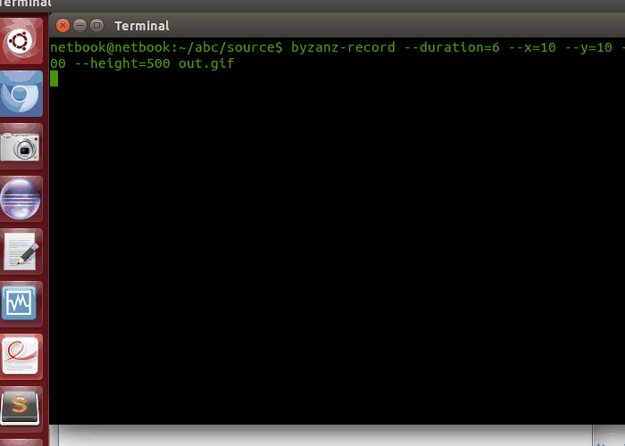

# TexteMania
TextMania is a toolkit in java used for include autocomplession like (T105) in your application.This is an example with an
text editor :




# Generate a tree data structure 
At the very begining, we have to generate a tree binary file data stucture with the option "-c" and a txt file with words in your dictionnary.


# comparison direct acess VS sequential access
option -s will provide the sequential access file -> it will take 10 seconds to loads the entire tree
without option by default we use random access, it takes 3 seconds to loads the same entire tree


*** thanks to  FileChannel.MapMode.READ_ONLY the programm generate it very fast !

generation : 
```java
 a = new Arbre(null);
	    try{
		FileChannel inChannel = new RandomAccessFile("../doc/Arbre.arb", "r").getChannel();
		MappedByteBuffer buffer = inChannel.map(FileChannel.MapMode.READ_ONLY, 0, inChannel.size());
		byte[] tab = new byte[buffer.remaining()];
		buffer.get(tab);
		ObjectInputStream o = new ObjectInputStream(new ByteArrayInputStream(tab));
		a = (Arbre)(o.readObject());
		inChannel.close();
		o.close();
	    }
	    catch(Exception e){
		System.out.println("Le fichier n'a pas pu etre charge");
		System.exit(1);
}
```

reading datas: 
```java
Dictionnaire d = new Dictionnaire();
		a = Arbre.dico(d.dico, d.pertinence);
		try{
		    ObjectOutputStream o = new ObjectOutputStream(new FileOutputStream("../doc/Arbre.arb"));
		    o.writeObject(a);
		    o.close();
		}
catch(Exception e){ e.printStackTrace(); }
```

# How it works 

We have two main functions to use (the correction and autocomplession like)
```java
 public ArrayList<String> correction(String prefixe){
	ArrayList<String> liste2 = new ArrayList<String>();
	char c;
	for(int i = 0; i < prefixe.length(); i++){
	    for(int j = 0; j < 39; j++){
		if(j < 26) c = (char)(j+97);
		else c = Arbre.caraSpe.get(j-26);
		liste2.add(prefixe.substring(0,i) + String.valueOf(c) + prefixe.substring(i+1,prefixe.length()));
		liste2.add(prefixe.substring(0,i) + String.valueOf(c) + prefixe.substring(i,prefixe.length()));
	    }
	    liste2.add(prefixe.substring(0,i) + prefixe.substring(i+1));
	    if(i != (prefixe.length()-1)) liste2.add(prefixe.substring(0,i) + prefixe.charAt(i+1) + prefixe.charAt(i) + prefixe.substring(i+2,prefixe.length()));
	}
	return liste2;
    }

    public void autoCompletion(String s, boolean bool){
	if(s.length() == 0) return;
	b = a.sousArbre(s.toLowerCase());
	if(b == null) return;
	if(bool) cv.liste.addAll(b.liste(s.toLowerCase()));
	else cv.listeCorrigee.addAll(b.liste(s.toLowerCase()));
}
```
* For this example we have a TXT file with all french words and an priority ID for each words 

* When we type a word, we have two list (4 words auto complete and 4 words with the best priority 
